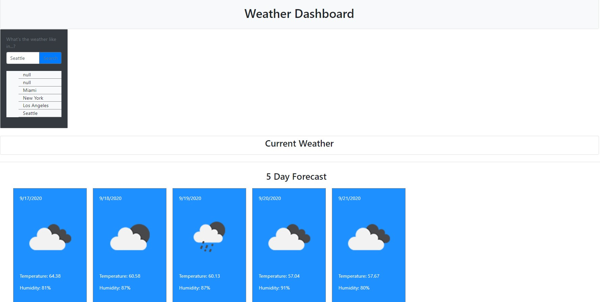

# Weather Dashboard

The purpose of this project was to build a weather dashboard so that travelers can quickly access current and future weather forecast information within a centralized and user friendly application.  This weather appliation utilizes Third-party APIs from [OpenWeather API](https://openweathermap.org/api) for the source weather data.  

## Notable Features
* Allows users to search for a city of their choice
* Provides users with current and 5 day weather forecast information
* Stores the user's recent searched cities for reference and quick access

## Application Demo
The following image demonstrates the application functionality:

## Accessing the application

* The application can be accessed directly via the following link: https://yarvelo23.github.io/weather-dashboard/

* The Github repository can be accessed at: https://github.com/yarvelo23/weather-dashboard

